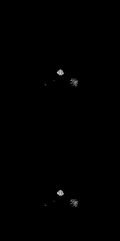
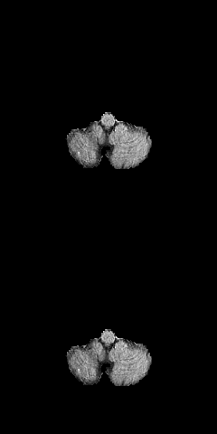

# 3DUnet-Tensorflow




3D Unet biomedical segmentation model powered by tensorpack with fast io speed.

Borrow a lot of codes from https://github.com/taigw/brats17/. I improved the pipeline and using tensorpack's dataflow for faster io speed. Currently it takes around 7 minutes for 500 iterations with patch size [5 X 20 X 144 X 144]. You can achieve reasonable results within 40 epochs (more gpu will also reduce your training time.)

I want to verify the effectiveness (consistent improvement despite of slight implementation differences and different deep-learning framework) of some architecture proposed these years. Such as
dice_loss, generalised dice_loss, residual connection, instance norm, deep supervision ...etc. Those design are popular and used in many papers in BRATS competition.  

+ [BRATS2017 1rd Solution, Ensembles of Multiple Models and Architectures for Robust Brain Tumour Segmentation](https://arxiv.org/pdf/1711.01468.pdf)
+ [BRATS2017 2rd Solution, Automatic Brain Tumor Segmentation using Cascaded Anisotropic Convolutional Neural Networks](https://github.com/taigw/brats17/)
+ [BRATS2017 3rd Solution](https://github.com/ellisdg/3DUnetCNN)

## Dependencies
+ Python 3; TensorFlow >= 1.4
+ Tensorpack@0.8.5 (https://github.com/tensorpack/tensorpack)
(pip install -U git+https://github.com/ppwwyyxx/tensorpack.git@0.8.5)
+ BRATS2017 or BRATS2018 data. It needs to have the following directory structure (you can also add your own validation data and test data, just to modify the path in config):
+ (Optional) If you want to use [Bias Correction](https://ieeexplore.ieee.org/abstract/document/5445030/) you have to install nipype and ANTs (see preprocess.py)
```
DIR/
  training/
    HGG/
    LGG/
  val/
    BRATS*.nii.gz
```
## Data
If you don't have Brats data, you can visit [ellisdg/3DUnetCNN](https://github.com/ellisdg/3DUnetCNN) where he provided sample data from TCGA.

You can modify data_loader.py to apply for different 3D datasets. The data sampling
strategy is defined in data_sampler.py BatchData class.

## Usage
Change config in `config.py`:
1. Change `BASEDIR` to `/path/to/DIR` as described above.

Train:
```
python3 train.py --logdir=./train_log/unet3d --gpu 0
```
Eval:
```
python3 train.py --load=./train_log/unet3d/model-30000 --gpu 0 --evaluate
```

Predict:
```
python3 train.py --load=./train_log/unet3d/model-30000 --gpu 0 --predict
```

**If you want to use 5 fold cross validation :**
1. Run generate_5fold.py to save 5fold.pkl
2. Set config CROSS_VALIDATION to True
3. Set config CROSS_VALIDATION_PATH to {/path/to/5fold.pkl}
4. Set config FOLD to {0~4}

## Results
The detailed parameters and training settings.
The results are derived from Brats2018 online evaluation on Validation Set.
## Single Model
### Setting 1:
Unet3d, num_filters=32 (all), depth=3, sampling=one_positive
+ PatchSize = [5, 20, 144, 144] per gpu, num_gpus = 2, epochs = 40
+ Lr = 0.01, num_step=500, epoch time = 6:35(min), total_training_time ~ 5 hours
### Setting 2:
Unet3d, num_filters=32 (all), depth=3, sampling=one_positive
+ PatchSize = [2, 128, 128, 128] pre gpu, num_gpus = 2, epochs = 40
+ Lr = 0.01, num_step=500, epoch time = 20:35(min), total_training_time ~ 8 hours
### Setting 3
Unet3d, num_filters=16~256, sampling=one_positive, **depth=5**, **residual**
+ PatchSize = [2, 128, 128, 128], num_gpus = 1, epochs = 20
+ Lr = 0.001, num_step=500, epoch time = 20(min), total_training_time ~ 8 hours
### Setting 4:
Unet3d, num_filters=16~256, **depth=5**, **residual** **InstanceNorm**, **sampling=random**
+ PatchSize = [2, 128, 128, 128], num_gpus = 1, epochs = 20
+ Lr = 0.001, num_step=500, epoch time = 20(min), total_training_time ~ 8 hours
### Setting 5:
Unet3d, num_filters=16~256, **depth=5**, **residual**, **InstanceNorm**, **sampling=one_positive**
+ PatchSize = [2, 128, 128, 128], num_gpus = 1, epochs = 20
+ Lr = 0.001, num_step=500, epoch time = 20(min), total_training_time ~ 8 hours
### Setting 6:
Unet3d, num_filters=16~256, **depth=5**, **residual**, **deep-supervision**,     **InstanceNorm**, **sampling=one_positive**
+ PatchSize = [2, 128, 128, 128], num_gpus = 1, epochs = 20
+ Lr = 0.001, epoch time = 19(min), total_training_time ~ 8 hours
### Setting 7:
Unet3d, num_filters=16~256, **depth=5**, **residual**, **deep-supervision**, **BatchNorm**, **sampling=one_positive**
+ PatchSize = [2, 128, 128, 128], num_gpus = 1, epochs = 20
+ Lr = 0.001, epoch time = 20(min), total_training_time ~ 8 hours
### Setting 8:
Unet3d, num_filters=16~256, **depth=5**, **residual**, **deep-supervision**, **InstanceNorm**, **sampling=random**
+ PatchSize = [2, 128, 128, 128], **num_gpus = 2**, epochs = 20
+ Lr = 0.001, epoch time = 22(min), total_training_time ~ 8 hours

| Setting | Dice_ET | Dice_WT | Dice_TC |
| --- | --- | --- | --- |
| 1 | 0.74 | 0.85 | 0.75 |
| 2 | 0.74 | 0.83 | 0.77 |
| 2* | 0.77 | 0.84 | 0.77 |
| 3 | 0.74 | 0.87 | 0.78 |
| 4 | 0.75 | 0.87 | 0.790 |
| 5 | 0.72 | 0.87 | 0.796 |
| 6 | 0.73 | 0.88 | 0.80 |
| 6* | 0.75 | 0.88 | 0.80 |
| 7 | 0.73 | 0.87 | 0.78 |
| 8* | 0.77 | 0.87 | 0.81 |

## Ensemble Results
### Multi-View:
Introduced by [Automatic Brain Tumor Segmentation using Cascaded Anisotropic Convolutional Neural Networks](https://github.com/taigw/brats17/). Trained with axial, sagittal and coronal and then average the prediction prob.

Currently only support manually set path for each model (see train.py after line 147.)

### Test-Time augmentation:
Testing with image augmentation to improve model robustness.
+ Flip: Predicting on original image and horizontal flipped image and average the prediction prob.

| Setting | Dice_ET | Dice_WT | Dice_TC |
| --- | --- | --- | --- |
| 8+Flip | 0.73 | 0.88 | 0.81 |
| 8*+Flip | 0.77 | 0.88 | 0.82 |
| Multi-View* | 0.78 | 0.89 | 0.81 |
| Multi-View*+Flip | 0.78 | 0.89 | 0.82 |

p.s. * means advanced post-processing

## Preprocessing
## Zero Mean Unit Variance (default)
Normalize each modality with zero mean and unit variance within brain region
## Bias Correction
Details in [Tustison, Nicholas J., et al. "N4ITK: improved N3 bias correction." IEEE transactions on medical imaging 29.6 (2010): 1310-1320.](https://ieeexplore.ieee.org/abstract/document/5445030/)

| Setting | Dice_ET | Dice_WT | Dice_TC |
| --- | --- | --- | --- |
| N4+8*+Flip | 0.76 | 0.87 | 0.80 |
| Multi-View*+N4+Flip | 0.76 | 0.89 | 0.80 |

Using preprocess.py to convert Brats data into corrected image. Will take one days to process 200+ files. (multi-threading could help) 
## Notes
Results for brats2018 will be updated and more experiments will be included. [2018/8/3]